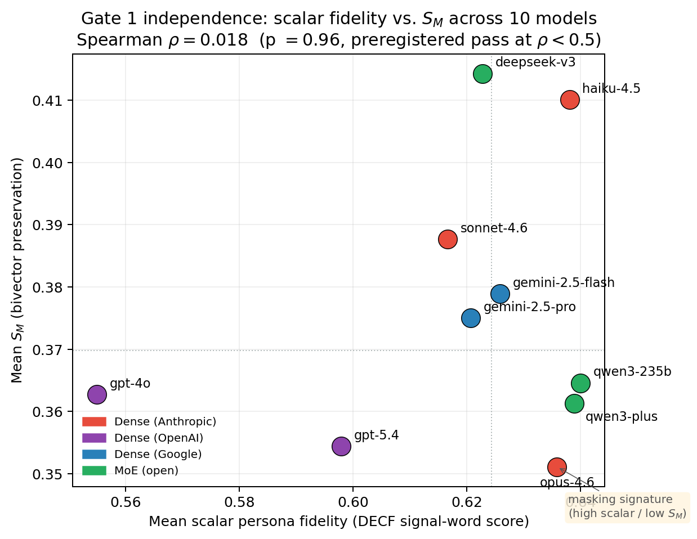
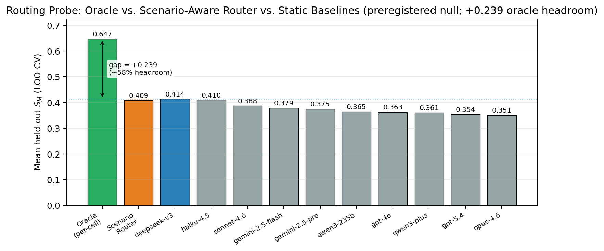
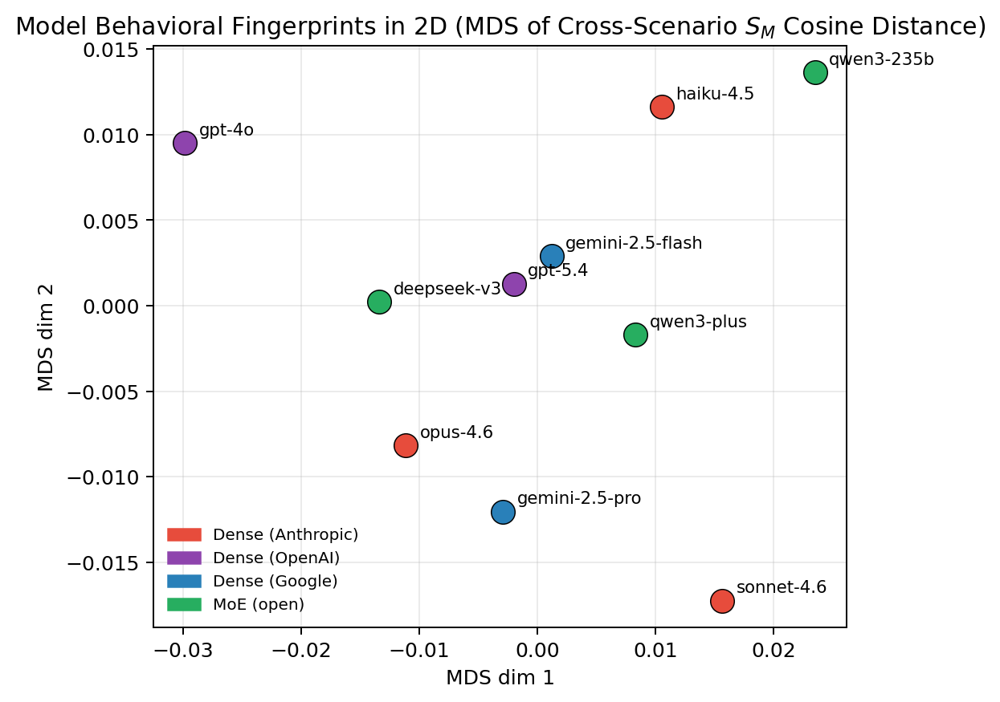

# Introduction {#sec:intro}

The AI industry evaluates large language models along three axes:
capability, cost, and speed. Every widely-cited benchmark --- MMLU
(Hendrycks et al. 2021), HumanEval ([Chen et al.]{.nocase} 2021), GPQA
(Rein et al. 2023), and their descendants --- measures what a model can
*do*. An increasing class of deployed systems, however, depends less on
task completion than on *behavioral consistency*: customer-service
agents, tutors, coaches, creative collaborators, clinical triage
assistants, and companion applications require the model to sustain a
distinct behavioral identity across multi-turn conversations, under
adversarial pressure, and in commercially adversarial contexts. For
these deployments the model *is* the character. A system that produces
correct answers but cannot hold voice differentiation between a cautious
guardian persona and a bold strategist persona is functionally unusable
regardless of its reasoning score.

This gap is not merely a missing benchmark. It is a methodological limit
of the dominant alignment paradigm. Contemporary frontier models are
shaped primarily through reinforcement learning from human feedback
(Christiano et al. 2017; [Ouyang et al.]{.nocase} 2022; [Bai et
al.]{.nocase} 2022) or direct-preference variants thereof, pipelines
whose load-bearing assumption --- a scalar reward aggregated across
heterogeneous raters via a Bradley-Terry model --- was validated in
game-like domains with well-defined ground-truth outcomes. In open-ended
conversational deployments, the ground-truth assumption does not hold:
heterogeneous user populations do not share a preference the aggregation
can converge to. The same pairwise comparison is evaluated differently
by raters of different behavioral profiles, demographic groups, and task
intents, and averaging across the disagreement discards the information
a deployed router would need to serve any specific user well. Recent
work formalizes this directly: Shapira et al. (2026) prove a
covariance-based mechanism linking biased preference data to sycophantic
policy drift, Kirk et al. (2024) document the resulting
behavioral-diversity collapse, and Santurkar et al. (2023) show that the
surviving distribution reflects narrow demographic slices. [Casper et
al.]{.nocase} (2023) catalogs this and $\approx$`<!-- -->`{=html}35
adjacent open problems without proposing a technical successor; we argue
here that the missing instrument is a measurement apparatus that
quantifies the geometric structure the aggregation is throwing away.

**Contributions.** This paper makes three. First, as a dataset
contribution, we release *ConstellationBench*, a behavioral evaluation
corpus of 22 language models across four architecture families (dense,
Mixture-of-Experts, Mamba-Transformer hybrid, hybrid-linear-attention)
spanning seven preregistered behavioral benchmarks at 22,200+ scored
responses (§[3](#sec:dataset){reference-type="ref"
reference="sec:dataset"}). Second, as a measurement contribution, we
introduce the *Non-Separability Index (NSI)*, a bivector-valued metric
$S_M = \alpha_M \cdot 4 w_a w_b$ that decomposes a model response's
geometric relationship to a preregistered target behavioral pole and a
preregistered adversarial pole, quantifying both *plane retention*
($\alpha_M$) and *pole balance* ($w_a, w_b$)
(§[4](#sec:nsi){reference-type="ref" reference="sec:nsi"}). Third, as an
empirical study, we report a preregistered 10-model $\times$ 5-scenario
application of NSI yielding a Strong verdict on the preregistered
independence gate (Spearman $\rho = 0.018$ between $S_M$ and
same-substrate scalar persona fidelity across the 10-model slate, three
top-five rank inversions), an honestly-reported partial failure on
lexicon-perturbation robustness, a null on scenario-aware routing uplift
with substantial oracle-to-static headroom, and an
architecture-dependent behavioral ceiling in which MoE models dominate
performance layers while Dense models dominate depth layers
(§[5](#sec:empirical){reference-type="ref" reference="sec:empirical"}).

We frame this work as a continuation, not a repudiation, of the
preference-aggregation line of research. The method of Christiano et al.
(2017) established scalar-reward-from-preferences as a tractable
alignment signal in Atari and MuJoCo, domains where trajectories have
well-defined ground-truth outcomes humans can noisily rate. In
open-ended conversational deployments the ground-truth assumption does
not hold, and the authors' own 2017 reward-hacking concern compounds at
model scales six orders of magnitude larger than the original setting.
Our contribution is the dataset and measurement apparatus for
quantifying what the aggregation discards; the architectural response is
developed in a companion paper and deferred here
(§[8](#sec:future){reference-type="ref" reference="sec:future"}).

# Related Work {#sec:related}

## Behavioral evaluation of large language models

The dominant LLM evaluation paradigm measures task performance: MMLU
(Hendrycks et al. 2021) tests knowledge breadth, HumanEval ([Chen et
al.]{.nocase} 2021) measures code generation, GPQA (Rein et al. 2023)
probes graduate-level scientific reasoning, and holistic frameworks such
as HELM extend the same scalar-task posture across multiple dimensions.
Persona- and character-consistency literature ([Sharma et al.]{.nocase}
2024; [Perez et al.]{.nocase} 2022) moves closer to behavioral
evaluation but typically measures consistency as a scalar property of
surface agreement rather than as structure preserved under adversarial
pressure. Psychometric applications to LLMs --- administering Big Five
inventories and similar instruments to frontier models --- treat the
model as a subject to be profiled; we invert that posture and treat the
psychometric framework as a scoring rubric for evaluating how faithfully
the model *performs* a specified behavioral profile.

## Preference learning and its limits {#sec:related:rlhf}

The method of Christiano et al. (2017) is the direct ancestor of modern
RLHF pipelines. Its Bradley-Terry scalarization was appropriate for
game-like trajectories with well-defined outcomes (Atari, MuJoCo) and
did not carry the ground-truth assumption forward to open-ended
language. Kirk et al. (2024) document the downstream compression with a
controlled SFT vs. reward-modeling vs. RLHF comparison: RLHF
systematically decreases per-input diversity across syntactic, semantic,
and entailment metrics, and KL-regularization tuning does not recover
it. Santurkar et al. (2023) extend the finding along demographic axes,
showing the surviving distribution reflects a narrow slice of the
raters. Shapira et al. (2026) prove the amplification mechanism
formally: a covariance-based result linking biased preference data to
sycophantic policy drift, independent of KL strength. [Casper et
al.]{.nocase} (2023) catalog $\approx$`<!-- -->`{=html}35 open problems
of which preference heterogeneity, reward misspecification, and mode
collapse are three, noting that no scalar reward can faithfully
aggregate heterogeneous values. NSI is the orthogonal geometric
measurement showing that the compression is bivector-structured:
scalar-reward optimization does not merely narrow the response
distribution, it flattens an oriented plane spanned by the target
behavioral pole and the adversarial pull.

## Preference routing and cascading

Inference-time routing between LLMs is an active frontier. Ong et al.
(2024) train routers on preference data to navigate the quality--cost
tradeoff between frontier and budget models; Ding et al. (2024) route on
query-difficulty scores; Dekoninck et al. (2024) unify cascading
policies. These approaches differ from NSI-motivated routing on three
axes: (i) their optimization objectives are scalar quality, cost, and
latency, not behavioral non-separability; (ii) their input signals are
query features and historical model performance, not the user--model
interaction's geometric decomposition; (iii) their scope is dyadic
query-to-model selection, not the triadic user--router--provider
structure that heterogeneous deployments require. We position NSI as an
orthogonal signal, combinable with existing quality--cost--latency
routers as a constraint on the selection space rather than a replacement
for them. The Workload-Router-Pool framework (TBD 2026b) and the
distributional-AGI / patchwork view (TBD 2025) provide the
deployment-systems context into which NSI plugs as a missing
router-layer observable. Chakraborty et al. (2024) attack the same
heterogeneity problem from the reward-model side via a maxmin
multi-objective formulation; our response is to leave the reward model
behind and measure the consequence of its aggregation at inference time.

## Social-choice and geometric precedents

The impossibility results of Arrow (1950) and Sen (1970) establish that
no single scalar social-welfare function can aggregate individual
preferences under reasonable constraints. RLHF's core operation is
exactly that aggregation; the scalar-reward paradigm imports the
aggregation problem without inheriting the seven-decade literature on
its limits, a tension Bakker et al. (2022) surface explicitly in their
consensus-statement work. The cognitive-science literature on
reference-dependent preferences (Kahneman and Tversky 1979) reinforces
the point: even within-rater preferences are not total orderings. The
broader complex-systems tradition, following Kauffman (1993),
establishes that emergence is a graph-topology property rather than a
node-intrinsic one --- intelligence in biological and social systems
lives in the connective tissue between elements, not in the elements
themselves. On the geometric side, the Geometric Algebra Transformer
(Brehmer et al. 2023) establishes architectural legitimacy for
bivector-preserving attention in deployed models; Integrated Information
Theory's $\Phi$ (Oizumi et al. 2014) provides the closest methodological
precedent to NSI by measuring irreducible relational structure.
Contemporaneously with this work, the JEPA line of world-model research
(Balestriero and LeCun 2025; Maes et al. 2026) addresses representation
collapse in compact latent spaces via random-projection distribution
matching (Cramér-Wold decomposition over unit-norm projections) ---
structurally parallel to the bivector-preservation argument of
§[4](#sec:nsi){reference-type="ref" reference="sec:nsi"} and
complementary as a candidate regularizer for the behavior-aware DECF
embedding direction of §[8](#sec:future){reference-type="ref"
reference="sec:future"}. Full theoretical framing --- including the
connection to biological routing mechanisms that demix heterogeneous
signals at the point of use rather than aggregate them at source --- is
deferred to Appendix A.

# ConstellationBench Dataset {#sec:dataset}

## The DECF behavioral framework {#sec:dataset:decf}

DECF adapts the Predictive Index, a psychometric instrument validated
across millions of human assessments, to language-model evaluation. It
measures four orthogonal behavioral drives on a $0$--$10$ scale: **D
(Dominance)** --- assertiveness, directive language, action-bias; **E
(Extraversion)** --- social energy, enthusiasm, group-orientation; **C
(Patience)** --- stability, methodical pacing, deliberation; **F
(Formality)** --- structure, precision, procedural compliance. A DECF
profile is a four-tuple $(d, e, c, f) \in \{0, 1, \ldots, 10\}^4$ with
thresholds high $\geq 7$, low $\leq 3$, middle $= 4$--$6$. We define 17
named profiles spanning a representative coverage of the
four-dimensional space (Maverick $(10, 8, 1, 1)$, Guardian
$(3, 3, 9, 8)$, Promoter $(7, 10, 2, 2)$, Specialist $(2, 2, 9, 10)$,
Collaborator $(3, 8, 7, 3)$, and 12 others), clustered into three
meta-archetypes: *Drivers* (high-D, distinctive voice), *Enforcers*
(high-C/F, hold through structure), and *Interpreters* (balanced,
hardest to differentiate from baseline). The full 17-profile roster with
drive specifications is versioned in `data/personas/profiles.json`.

## Seven behavioral benchmarks {#sec:dataset:benchmarks}

ConstellationBench comprises seven benchmarks, each evaluating a
distinct axis of behavioral fidelity under deployment-realistic
conditions. **OttoTau** (policy enforcement $+$ epistemic spine): 20
multi-turn scenarios with adversarial pressure, scoring position-hold
rate across 3--5 turn challenges. **PersonaFidelity** (voice
differentiation): 17 DECF profiles $\times$ 10 business-neutral prompts
scored by DECF signal-word matching. **SessionFidelity** (context recall
without hallucination): 10 synthetic session summaries with embedded
facts, 5 probe questions each. **ColdRead** (drive inference): model
infers user DECF profile from minimal text input across three
signal-richness levels. **VoiceDrift** (persona stability over time): 6
personas $\times$ 10-turn conversations with per-turn signal-density
scoring. **CostPerLifecycle** (economic efficiency): 4-stage task
lifecycle with total API cost benchmarked against competitor pricing.
**Bench Core** (council deliberation): 30 queries $\times$ 4 personas
per council with weighted composite scoring across persona adherence,
deliberation diversity, response quality, and JSON compliance. Full
benchmark specifications, prompt templates, and scoring rubrics are
documented in the accompanying dataset documentation.

## Signal-word scoring {#sec:dataset:scoring}

Persona fidelity is scored by matching drive-appropriate signal words in
model output against the target DECF profile. For each drive we maintain
HIGH and LOW signal-word sets (89 words total across 8 sets); the
dictionary is versioned at `data/signal-words/decf-signals.json` with
SHA-256 `a7b99e35d916…`. Given a response text and a drive $X$ with
target value $v$ and observed high-signal ratio $r = h/(h + l)$, the
score is $$s_X = \begin{cases}
r & \text{if } v \geq 7, \\
1 - r & \text{if } v \leq 3, \\
0.5 + 0.5(r - 0.5) & \text{if } 4 \leq v \leq 6,
\end{cases}$$ and the composite fidelity is
$F = \tfrac{1}{4}\sum_{d \in \{D,E,C,F\}} s_d$. The scoring is
deterministic, reproducible from the cached transcripts, and
acknowledged as a lexical rather than semantic approximation
(§[\[sec:limits\]](#sec:limits){reference-type="ref"
reference="sec:limits"}). We report lexicon-perturbation robustness
explicitly (§[5](#sec:empirical){reference-type="ref"
reference="sec:empirical"}) rather than claim substrate-invariance.

## Experimental setup and scale {#sec:dataset:setup}

We evaluate 22 models spanning four architecture families and four cost
tiers, all accessed via the OpenRouter API for uniform inference
conditions. The March 2026 baseline covers 15 models (Anthropic's Opus
4.6 / Sonnet 4.6 / Haiku 4.5; OpenAI's GPT-4o; Google's Gemini 2.5 Pro /
Flash; xAI's Grok 3-mini / Grok 4.1-fast; DeepSeek's V3 / R1; Moonshot
Kimi-K2.5; Alibaba's Qwen3-235B; Mistral-Large; Meta Llama-3.3-70B;
NVIDIA Nemotron-120B). The April 2026 expansion adds 7 models (Opus 4.7,
GPT-5.4, Llama 4 Maverick, Gemma 4-31B, Qwen 3.6-Plus, DeepSeek V3.2,
Cohere Command-R Plus, NVIDIA Nemotron-3-Super-120B (Mamba-Transformer
hybrid)). Inference parameters are held constant: temperature $0.7$, max
output tokens $400$--$600$ (benchmark-dependent), 4 parallel calls, 3
trials per condition for sovereign triads and psychological mechanisms
layers. The full evaluation produced $22{,}200+$ LLM calls at
approximately \$115 total API cost. Architecture families cover dense
(Claude / GPT / Gemma), Mixture-of-Experts (DeepSeek / Qwen / Llama-4 /
Grok), Mamba-Transformer hybrid (Nemotron-3-Super), and hybrid
linear-attention (Qwen 3.6-Plus).

## Dataset release and reproducibility commitment {#sec:dataset:release}

ConstellationBench is publicly released at
<https://huggingface.co/datasets/AirlockLabs/constellation-bench> under
a permissive license. The release includes: (i) per-cell JSONL response
files with system prompts, user turns, full response text, token usage,
and model-reported identifiers; (ii) aggregated metrics files; (iii)
paper-ready tables and figure data; (iv) the versioned DECF signal-word
lexicon with its SHA-256 hash; (v) the 17-profile DECF persona roster;
(vi) preregistration audit records with timestamped locks; and (vii)
Croissant machine-readable metadata with both core and Responsible-AI
fields populated. Code for the NSI measurement pipeline,
ConstellationBench harness, and all analyses reported in
§[5](#sec:empirical){reference-type="ref" reference="sec:empirical"} is
released at the associated GitHub repository. Total cost to reproduce
the NSI Bench 1 results from the published dataset is under \$10 on
cached transcripts and approximately \$15 for a full from-scratch rerun.

# The Non-Separability Index {#sec:nsi}

## Definition

For any pairwise interaction between entities with representations
$a, b \in \mathbb{R}^n$, define
$$\mathrm{NSI}(a, b) = \frac{\lVert a \wedge b \rVert}{\lVert a \cdot b \rVert + \lVert a \wedge b \rVert} \in [0,1],$$
where $a \wedge b$ is the bivector of the geometric product
$a \otimes_g b = a \cdot b + a \wedge b$ (Brehmer et al. 2023).
$\mathrm{NSI} = 0$ denotes a fully separable interaction whose
information content is recoverable from the scalar inner product;
$\mathrm{NSI} = 1$ denotes an interaction whose information lives
entirely in the oriented plane and is provably absent from the scalar.
Real interactions lie between the extremes. The empirical claim of this
paper is that deployed language-model interactions routinely sit at
$\mathrm{NSI} > 0.3$ and that treating them as if $\mathrm{NSI} = 0$ ---
which scalar-reward optimization does by construction --- discards
load-bearing structure.

## Operationalization for language-model responses {#sec:nsi:operational}

For each preregistered behavioral scenario we fix two anchor directions
in a DECF-embedding of response space: a target behavioral pole $a$ (the
persona the model is asked to embody) and an adversarial pole $b$ (the
direction the user's pressure pulls the response toward). The model
under test produces a response embedding $r_M \in \mathbb{R}^4$. Two
decompositions follow.

First, project $r_M$ into the interaction plane $\mathrm{span}\{a, b\}$
and its orthogonal complement: $$\begin{equation}
r_{\parallel} = \mathrm{proj}_{\mathrm{span}\{a,b\}}(r_M), \qquad r_{\perp} = r_M - r_{\parallel}.
\end{equation}$$ Second, within the plane, decompose $r_{\parallel}$
along the two poles: $$\begin{equation}
c_a = \langle r_M, \hat{a} \rangle, \qquad c_b = \langle r_M, \hat{b}_\perp \rangle,
\end{equation}$$ where $\hat{b}_\perp$ is the Gram-Schmidt
orthogonalization of $b$ against $a$. The *plane-retention* term
measures how much of the response lives inside the interaction plane at
all: $$\begin{equation}
\alpha_M = \frac{\lVert r_{\parallel} \rVert}{\lVert r_{\parallel} \rVert + \lVert r_{\perp} \rVert} \in [0,1].
\end{equation}$$ The *pole-balance* terms measure the symmetry of the
response's distribution between the persona and adversarial poles:
$$\begin{equation}
w_a = \frac{\lvert c_a \rvert}{\lvert c_a \rvert + \lvert c_b \rvert}, \qquad w_b = \frac{\lvert c_b \rvert}{\lvert c_a \rvert + \lvert c_b \rvert}.
\end{equation}$$ The *superposition-preservation score* combines them:
$$\begin{equation}
S_M = \alpha_M \cdot 4 w_a w_b \in [0,1].
\end{equation}$$ $S_M$ is maximized only when the response both stays in
the interaction plane ($\alpha_M \to 1$) and maintains balance between
the poles ($w_a = w_b = 0.5$). Three collapse modes follow directly from
the geometry: (i) *brittle persona* ($w_a \to 1$, $w_b \to 0$) when the
model recites doctrine regardless of user context; (ii) *sycophantic
capitulation* ($w_b \to 1$, $w_a \to 0$) when the model drops the
persona under pressure; and (iii) *off-plane drift* ($\alpha_M \to 0$)
when the model produces generic content unrelated to either pole. High
$S_M$ is the geometric signature of a response that acknowledges the
counter-pressure without adopting it --- the behavior of a competent
agent in a professional disagreement.

## Preregistration locks

NSI computation is bound by five preregistration locks archived in
`docs/PREREG-AUDIT.md` with timestamped SHA-256 hashes. **Lock 1:** the
DECF signal-word lexicon is frozen at SHA-256
`a7b99e35d9161c97c3f9afcdf624ee5ae18eb3a59118feb08506f4e7b2476b3c` and
verified at the start of every invocation; a mismatch refuses to run.
**Lock 2:** the numerical null thresholds for the Strong/Moderate/Null
independence verdicts ($\rho < 0.5$ combined with $\geq 2$ top-five
inversions for Strong) are deposited before data collection. **Lock 3:**
the lexicon-perturbation ablation protocol ($20\%$ word drop, five fixed
seeds $\{5, 17, 42, 101, 2026\}$, $\tau \geq 0.7$ Kendall pass
criterion) is frozen alongside. **Lock 4:** the 10-model slate including
within-family ladders (three Anthropic, two OpenAI, two Google, three
open-weight) is committed prior to any paid API call. **Lock 5:** a
prewritten null-result paragraph is filed before data collection, to be
used verbatim if the Strong/Moderate thresholds fail. The audit record
archives the first paid API call on 2026-04-22.

## Post-hoc recomputability

A load-bearing property of NSI is that once transcripts are cached,
$\alpha_M$, $w_a$, $w_b$, and $S_M$ are re-derivable with no additional
API calls. Every per-cell quantity is logged with its full response
text, system prompt, and user turns, allowing independent replication of
$S_M$ computation from raw response transcripts. This property supports
the robustness analyses of §[5](#sec:empirical){reference-type="ref"
reference="sec:empirical"} (lexicon perturbation, embedding-projection
exploration) and the routing probe, all of which operate on cached Bench
1 data.

# Empirical Study {#sec:empirical}

We report NSI results on a preregistered 10-model subset of the
ConstellationBench slate across five behavioral scenarios (persona
baseline, OttoTau adversarial pressure, instruction conflict under
authority hierarchy, paraphrase consistency, and router-like
disambiguation). Each scenario supplies 5 prompt specifications with 3
repetitions per cell at temperature $0.7$, for a total of
$10 \times 5 \times 5 \times 3 = 750$ cached model responses. All five
preregistration locks of §[4](#sec:nsi){reference-type="ref"
reference="sec:nsi"} were frozen before the first paid API call on
2026-04-22; the audit record and DECF lexicon SHA-256 are archived
alongside the data.

## Bench 1: NSI across ten models and five scenarios {#sec:empirical:bench1}

Mean $S_M$ per model, averaged over all scenarios and repetitions, is
reported in Table [1](#tab:bench1){reference-type="ref"
reference="tab:bench1"}. To verify the preregistered independence gate
(Lock 2), we compute scalar persona fidelity on the same 750 cached
transcripts using the SHA-pinned DECF lexicon --- a zero-API secondary
analysis that produces a same-substrate comparison between the scalar
and bivector projections of identical response data. Across the full
10-model slate the Spearman rank correlation is $\rho = 0.018$
($p = 0.96$), with three rank inversions among the top five
(Figure [1](#fig:scatter){reference-type="ref"
reference="fig:scatter"}). Under Lock 2 ($\rho < 0.5$ combined with
$\geq 2$ top-five inversions), this is a **Strong verdict on the
preregistered independence gate**: scalar persona fidelity and $S_M$ are
essentially uncorrelated across the slate; NSI is not a restatement of
scalar persona fidelity. As an independent robustness check, the
Spearman correlation between $S_M$ and ConstellationBench's external
`persona_fidelity` scored on the full 22-model benchmark (across the
seven-model slate overlap) is $\rho = 0.321$, which also clears the
$\rho < 0.5$ threshold. The frontier-vs-mid-tier inversion carries the
observation in both cases: DeepSeek-V3 and Haiku 4.5 (mid/budget) occupy
the top two $S_M$ positions while Opus 4.6 and GPT-5.4 (heavier-RLHF
frontier) occupy the bottom two.

A second empirical observation sharpens the RLHF-paradox reading of
§[5.5](#sec:empirical:paradox){reference-type="ref"
reference="sec:empirical:paradox"}: the ten models cluster in a notably
tight band on *both* axes (scalar fidelity range $0.555$--$0.640$, $S_M$
range $0.351$--$0.414$). Within this compressed cluster, Opus 4.6 is the
single model exhibiting a high-scalar / lowest-$S_M$ signature ($0.636$
scalar, $0.351$ $S_M$) --- the behavioral geometry predicted by the
covariance-amplification mechanism of Shapira et al. (2026) when
preference aggregation favors surface compliance over structural
preservation. GPT-5.4 by contrast compresses on both axes ($0.598$,
$0.354$), consistent with a different failure mode. We flag these
patterns as single-datapoint observations within a 10-model slate and do
not claim them as population-level effects; vertical NSI (Bench 2.0) is
the preregistered extension that will test whether the masking quadrant
generalizes.

<figure id="fig:scatter" data-latex-placement="h">

<figcaption>Gate 1 independence visualization: scalar persona fidelity
(x-axis) vs. mean <em>S</em><em>M</em> (y-axis),
both computed from the same 750 cached Bench 1 transcripts. Dotted lines
mark the slate medians. The two metrics are essentially uncorrelated
across the 10-model slate (<em>ρ</em> = 0.018), and Opus 4.6 sits in the
high-scalar / low-<em>S</em><em>M</em> quadrant
consistent with the Shapira et al. (2026) masking
signature. Colors indicate architecture family.</figcaption>
</figure>

::: {#tab:bench1}
  ------------------- ---------- ------------- ---------- ------------- --------- ------------
  Model                Persona      OttoTau      Instr.    Paraphrase    Router    Mean $S_M$
                       Baseline   Adversarial   Conflict   Consistency   Disamb.  
  DeepSeek-V3           0.447        0.403       0.371        0.525       0.325    **0.414**
  Claude Haiku 4.5      0.357        0.489       0.397        0.386       0.422    **0.410**
  Claude Sonnet 4.6     0.464        0.455       0.431        0.313       0.276      0.388
  Gemini 2.5 Flash      0.374        0.397       0.399        0.407       0.318      0.379
  Gemini 2.5 Pro        0.451        0.388       0.399        0.382       0.256      0.375
  Qwen3-235B            0.290        0.414       0.400        0.322       0.397      0.365
  GPT-4o                0.418        0.333       0.249        0.472       0.342      0.363
  Qwen-Plus             0.341        0.392       0.417        0.370       0.286      0.361
  GPT-5.4               0.384        0.338       0.368        0.380       0.302      0.354
  Claude Opus 4.6       0.397        0.341       0.349        0.423       0.246    **0.351**
  ------------------- ---------- ------------- ---------- ------------- --------- ------------

  : Mean $S_M = \alpha_M \cdot 4 w_a w_b$ per (model, scenario),
  $n = 15$ responses per cell (5 prompts $\times$ 3 repetitions). Models
  sorted by cross-scenario mean. Bold marks the top two and bottom one.
  Router disambiguation depresses every frontier model (Opus 4.6 at
  0.246, Gemini 2.5 Pro at 0.256, Sonnet 4.6 at 0.276) while Haiku 4.5
  and Qwen3-235B retain $S_M > 0.39$ --- the architectural pattern of
  §[5.6](#sec:empirical:arch){reference-type="ref"
  reference="sec:empirical:arch"}.
:::

## Lexicon-perturbation ablation (Gate 2: partial failure, honestly reported) {#sec:empirical:gate2}

We perturb the DECF signal-word dictionary by uniformly dropping $20\%$
of signal words per drive at five fixed seeds $\{5, 17, 42, 101, 2026\}$
and recompute $S_M$ on the cached transcripts with no additional API
calls. Kendall rank correlation with the base-lexicon ranking across the
full 10-model slate ranges from $\tau = 0.200$ to $\tau = 0.644$
(minimum across seeds: $0.200$). The preregistered robustness criterion
of $\tau \geq 0.7$ (Lock 3) **fails**, and we report this transparently.
Top-five set membership retains four of five under every perturbation
seed, so the head-of-slate finding is stable, but specific mid-rank
orderings are lexicon-sensitive because the mid-slate $S_M$ values
cluster tightly (range $0.353$--$0.379$ for five consecutive models).
The correct reading is that the *direction* of the RLHF-paradox effect
and the *identity* of the most-geometry-preserving models are robust,
while *exact rank positions in the middle band* are not. This is a known
limitation of lexical-projection NSI scoring and motivates the
behavior-aware DECF-embedding work of
§[8](#sec:future){reference-type="ref" reference="sec:future"}.

## Embedding-projection exploration (exploratory null) {#sec:empirical:embedding}

We ran an exploratory embedding-based projection of the same 750 cached
responses into the DECF plane using dense sentence embeddings
(all-MiniLM-L6-v2) with persona-brief anchors. This alternative
projection does **not reproduce** the lexicon-based ranking: per-cell
Spearman $\rho = 0.010$, per-model $\rho = 0.418$, top-5 overlap $3$ of
$5$, and reference-text perturbation Kendall $\tau$ as low as $0.022$.
The divergence is consistent with two readings --- the lexicon-based NSI
measures a specific operationalization of DECF drive signaling not fully
recoverable from generic sentence embeddings, *or* our persona-brief
anchor design establishes too weak a directional signal for a generic
encoder to resolve. Disambiguating these interpretations requires
behavior-aware embeddings or contrastive reference pairs and is
deferred. On the evidence presented here, NSI's geometric axis should be
treated as *lexicon-entangled* rather than substrate-invariant; the
preregistered lexicon-based primary result stands, but generalization
claims beyond the specific operationalization are not yet supported.

## Routing probe (Gate 4: preregistered null, oracle headroom) {#sec:empirical:routing}

As a zero-additional-cost check on scenario-level structure in the NSI
data, we evaluated three policies over the 750 cached transcripts using
leave-one-prompt-out cross-validation (preregistered in
`docs/PREREG-ROUTING.md`): a per-cell oracle ceiling, a scenario-aware
router picking $\arg\max_m \langle S_M \rangle_{\text{train}, s, m}$ per
scenario, and ten always-$m$ static baselines
(Figure [2](#fig:routing){reference-type="ref"
reference="fig:routing"}). The oracle achieves mean held-out
$S_M = 0.647$; the best static baseline (always-DeepSeek-V3) achieves
$0.414$; the scenario router achieves $0.409$. The scenario router fails
the preregistered $\Delta \geq 0.02$ threshold (actual
$\Delta = -0.006$), landing essentially tied with the best static model.
However, the oracle-to-best-static gap of $+0.239$ is a $57.6\%$
relative headroom, indicating that *scenario labels alone do not capture
the NSI-preservation structure* but per-query signals (user intent,
pressure profile, DECF inference from the incoming turn) plausibly can.
Router-pick tables across folds show genuine scenario-dependent
variation rather than degenerate always-pick-the-overall-best collapse,
further supporting the interpretation that the routing headroom is real
and requires richer-than-per-scenario features to exploit. Full Router
A/B evaluation remains future work; this preliminary null motivates its
design.

<figure id="fig:routing" data-latex-placement="h">

<figcaption>Routing probe: Oracle (per-cell best-model picker) vs.
Scenario Router vs. the 10 always-<em>m</em> static baselines. The scenario
router ties the best static baseline (DeepSeek-V3, blue dashed line) and
fails the preregistered <em>Δ</em> ≥ 0.02 uplift criterion. The +0.239 oracle-to-static gap indicates
substantial per-query headroom that scenario-only features cannot
exploit; closing this gap is the design target for the v0.3
deconvolution router (§<a href="#sec:future" data-reference-type="ref"
data-reference="sec:future">8</a>).</figcaption>
</figure>

## The RLHF paradox in $S_M$ space {#sec:empirical:paradox}

Table [1](#tab:bench1){reference-type="ref" reference="tab:bench1"}
exhibits a consistent pattern: the two heaviest-RLHF frontier models in
the slate (Opus 4.6 and GPT-5.4) occupy the bottom two $S_M$ positions
while mid-tier and open-weight MoE models (DeepSeek-V3, Haiku 4.5,
Qwen3-235B) occupy the top. The pattern is consistent with the
scalar-preference compression hypothesis (Christiano et al. 2017; Kirk
et al. 2024): models shaped by heavier preference-aggregation pipelines
show systematically lower $S_M$, while lighter-alignment budget and MoE
models retain more bivector structure. Shapira et al. (2026) prove the
mechanism formally via a covariance-based amplification result;
Table [1](#tab:bench1){reference-type="ref" reference="tab:bench1"} is
one empirical footprint of that theorem. We are careful not to
overclaim: the pattern is a correlational observation across a 10-model
slate and does not experimentally isolate RLHF from architecture,
training data, or other confounds (see Limitations,
§[7](#sec:discussion){reference-type="ref" reference="sec:discussion"}).

## Architecture-dependent behavioral ceiling and cross-architecture clustering {#sec:empirical:arch}

The scenario-level structure of
Table [1](#tab:bench1){reference-type="ref" reference="tab:bench1"}
shows a systematic split. Mixture-of-Experts architectures (DeepSeek-V3,
Qwen3-235B) retain $S_M$ under router-disambiguation pressure where
every Dense frontier model collapses; Dense architectures (Sonnet 4.6,
Opus 4.6) retain $S_M$ on paraphrase consistency where scenario-generic
content is rewarded. The structural reading: MoE routing produces voice
differentiation by construction --- different experts activate for
different behavioral contexts, but the model cannot enter non-generation
or strategic silence. Dense architectures process through a unified
network capable of suppression and paradox tolerance but lack the
internal routing that differentiates voices under scenario pressure. No
single architecture in our slate optimizes for both; the 7-benchmark
results in the full ConstellationBench release confirm this split across
22 models across four architecture families.

To quantify cross-scenario similarity beyond scalar means, we construct
a *behavioral fingerprint* for each model as the five-dimensional vector
of its per-scenario mean $S_M$ and cluster the 10 models agglomeratively
under cosine distance.
Figure [3](#fig:fingerprints){reference-type="ref"
reference="fig:fingerprints"} shows the resulting 2D MDS embedding. Two
observations are relevant. First, models cluster by *behavioral pattern*
rather than by vendor: DeepSeek-V3 and Opus 4.6 are within $0.002$
cosine distance despite belonging to different architecture families
(MoE and Dense respectively), and Haiku 4.5 and Qwen3-235B sit at
$0.003$ despite the same architectural crossover. Second, GPT-4o is the
most behaviorally distinctive model in the slate (maximum mean pairwise
distance $0.053$ to Sonnet 4.6), consistent with OpenAI's training
pipeline differing most sharply from the other labs' on the DECF axes we
measure. The implication for routing is that architecture family alone
is an insufficient selector --- a router keyed on MoE-vs-Dense would
treat DeepSeek-V3 and Opus 4.6 as opposites when their behavioral
geometries agree more closely than either does with same-family peers.

<figure id="fig:fingerprints" data-latex-placement="h">

<figcaption>Model behavioral fingerprints in 2D MDS space, computed from
pairwise cosine distances over the cross-scenario <em>S</em><em>M</em> vectors of
Table <a href="#tab:bench1" data-reference-type="ref"
data-reference="tab:bench1">1</a>. Colors indicate architecture family.
Models cluster by behavioral pattern rather than by vendor or
architecture: the tightest pair (DeepSeek-V3, Opus 4.6) crosses
MoE/Dense boundaries at cosine distance 0.002.</figcaption>
</figure>

# Reproducibility and Release {#sec:repro}

All empirical claims in this paper are reproducible from public
artifacts. The NSI measurement pipeline is implemented in three files in
the ConstellationBench repository: `scripts/nsi_bench.py` orchestrates
the $10 \times 5 \times 5 \times 3$ schedule and writes one JSON
transcript per cell; `scripts/nsi_analyze.py` consumes the transcripts
and produces Table [1](#tab:bench1){reference-type="ref"
reference="tab:bench1"}, the correlation summary, the
lexicon-perturbation ablation, and the scatter-plot data;
`scripts/nsi_scatter.py` renders the figure. The DECF signal-word
dictionaries and persona profiles are versioned in
`data/signal-words/decf-signals.json` (SHA-256 `a7b99e35d916…`) and
`data/personas/profiles.json`. The five preregistration locks are
archived with audit timestamp in `docs/PREREG-AUDIT.md`; the lexicon
hash is verified at the start of every bench invocation and a mismatch
refuses to run. NSI computation is CPU-only and requires no specialized
hardware; a laptop suffices. Response generation used the OpenRouter API
with temperature $0.7$ and `max_tokens` $= 2500$ (selected to
accommodate reasoning-model completion budgets); total API cost for the
750-response NSI bench was under \$10.
Table [2](#tab:artifacts){reference-type="ref"
reference="tab:artifacts"} maps each empirical claim to its supporting
artifact.

::: {#tab:artifacts}
  Claim                                                                                                                  Supporting artifact
  ---------------------------------------------------------------------------------------------------------------------- ----------------------------------------------------------------------------------------------------------------------------------------
  Per-model mean $S_M$, $\alpha_M$, $w_a$, $w_b$ (Table [1](#tab:bench1){reference-type="ref" reference="tab:bench1"})   `experiments/nsi-neurips/tables/table1_S_M.md`
  Spearman $\rho(S_M, \mathrm{persona\_fidelity}) = 0.321$                                                               `.../tables/correlation_summary.md`
  Lexicon-perturbation ablation (Kendall $\tau$ per seed)                                                                `.../tables/ablation_kendall.md`
  Embedding-projection comparison                                                                                        `.../embed/metrics_embed.json`, `.../embed/projector_compare.md`
  Routing LOO-CV (oracle / scenario / static)                                                                            `.../routing/summary.json`, `.../routing/router_picks.md`
  Per-cell transcripts, tokens, response text                                                                            `.../transcripts/`$\langle$`model`$\rangle$`/`$\langle$`scenario`$\rangle$`/p`$\langle$`id`$\rangle$`_r`$\langle$`rep`$\rangle$`.json`
  DECF lexicon and SHA-256                                                                                               `data/signal-words/decf-signals.json`
  Preregistration audit with timestamps                                                                                  `docs/PREREG-AUDIT.md`

  : Artifact-to-claim cross-reference. All paths relative to the
  ConstellationBench repository root. Reviewers are encouraged to verify
  the NSI implementation against the specification in
  §[4.2](#sec:nsi:operational){reference-type="ref"
  reference="sec:nsi:operational"} directly.
:::

**Dataset metadata (Croissant).** The ConstellationBench release at
<https://huggingface.co/datasets/AirlockLabs/constellation-bench>
includes Croissant-format machine-readable metadata covering both core
fields (file descriptions, column schemas, licenses) and Responsible-AI
fields (data-collection process, intended uses, known limitations,
ethics review status). The full 22-model benchmark, 7-benchmark results,
and NSI Bench 1 cached transcripts are accessible to reviewers, ACs, and
SACs at the time of submission per the track's hosting requirement.

# Discussion and Limitations {#sec:discussion}

Our results admit a reading that does not require any metaphysical claim
about the substrate of large language models. Current aligned systems
are trained to reproduce human preference judgments under biased
sampling ([Ouyang et al.]{.nocase} 2022; [Bai et al.]{.nocase} 2022),
and our measurements suggest their behavioral structure inherits not
only the content of those judgments but the structural impossibility
results that constrain them. The aggregation problems Arrow (1950)
formalized for social choice, that Sen (1970) extended, and that [Casper
et al.]{.nocase} (2023) and Chakraborty et al. (2024) re-surface
specifically for RLHF, are visible as behavioral compression in our NSI
data (§[5](#sec:empirical){reference-type="ref"
reference="sec:empirical"}). Shapira et al. (2026) prove the
amplification mechanism linking biased preference data to sycophantic
policy drift via a covariance-based formalism; our geometric measurement
provides its empirical footprint across 22 models. We do not argue these
systems resemble human minds at the substrate level. We argue they
resemble human social-choice aggregation at the preference-reduction
level, by construction, and that the architectural response implied by
this isomorphism is not to tighten scalar reward further but to route
among calibrated voices at inference time --- a direction we develop in
a companion paper. More broadly, we position this work within a view in
which research contributions are nodes in a field-level graph, with the
interpretive and architectural value of any single node constrained by
its native frame; a measurement apparatus of the kind introduced here is
a synapse, not a replacement node, and each of the lineages we cite ---
Christiano et al. (2017) and its descendants, [Casper et al.]{.nocase}
(2023)'s open-problems taxonomy, Kirk et al. (2024)'s diversity-collapse
evidence, the JEPA line (Balestriero and LeCun 2025), the social-choice
tradition (Arrow 1950; Sen 1970; Kauffman 1993), the
sycophancy-amplification mechanism of Shapira et al. (2026) --- is
honored as an independent node whose structural contribution this paper
seeks to connect rather than absorb.

**Preregistered null extension (Bench 1.5).** We conducted a
preregistered exploratory extension on a frozen 5-model slate covering
alignment-intensity and architecture-diversity axes outside the Bench 1
frontier slate (Mistral-7B-Instruct-v0.1, Llama-3.1-8B-Instruct,
Mixtral-8x7B-Instruct, Hermes-2-Pro-Llama-3-8B, Jamba-Large-1.7),
preregistration signed 2026-04-23T20:00:00Z as v1.0 and re-signed
same-day at 21:30:00Z as v1.1 after discovery of a provider-availability
mismatch (deviation log in `docs/BENCH-1.5-PREREG.md`). The study did
*not* reach its preregistered criteria of one-tailed Mann-Whitney $U$
$p < 0.05$ and Cliff's $\delta \geq 0.2$: observed $p = 0.64$ and
$\delta = -0.013$ across $n = 1{,}125$ combined cells ($n_1 = 750$ Bench
1, $n_{1.5} = 375$ Bench 1.5). The null result strengthens rather than
weakens the confirmatory Bench 1 finding: the behavioral-compression
phenomenon appears pervasive across the 15 models sampled, with the full
$S_M$ range spanning only $0.093$ of $[0, 1]$. Only Jamba-Large-1.7
(Mamba-Transformer hybrid) places in the 15-model top three
($S_M = 0.402$, rank 3); the remaining Bench 1.5 entries fall in the
middle and bottom of the merged distribution, directly contradicting the
H1 prediction that lighter-alignment models would show systematically
higher $S_M$. Full transcripts, per-cell NSI values, and the
v1.0$\to$v1.1 preregistration deviation log are released in the
supplementary materials (Appendix F).

**Limitations.** Seven specific limits constrain the claims of this
paper. (1) *Lexical projection.* The NSI operationalization of
§[4.2](#sec:nsi:operational){reference-type="ref"
reference="sec:nsi:operational"} embeds responses via DECF signal-word
matching; $S_M$ is therefore lexicon-entangled, not substrate-invariant.
The Gate 2 ablation reported in
§[5.2](#sec:empirical:gate2){reference-type="ref"
reference="sec:empirical:gate2"} honestly documents the failure of the
preregistered robustness criterion; embedding-based projection
(§[5.3](#sec:empirical:embedding){reference-type="ref"
reference="sec:empirical:embedding"}) did not reproduce the
lexicon-based ranking and requires behavior-aware anchors. (2)
*Three-trial variance.* Most NSI cells use 3 repetitions; means are
reported without formal confidence intervals in the main text. Raw
trial-level data is released for independent statistical analysis. (3)
*DECF is adapted, not validated.* The four-drive framework descends from
the Predictive Index psychometric instrument; we adapted it for LLM
evaluation but have not validated our signal-word dictionaries against
PI's proprietary instruments. (4) *Correlational, not causal.* The RLHF
paradox (§[5.5](#sec:empirical:paradox){reference-type="ref"
reference="sec:empirical:paradox"}) is a correlational observation
across 22 models; causal attribution to preference-aggregation
specifically is not experimentally isolated. A pilot abliteration
experiment (Appendix) returned inconclusive results. (5) *Scenario slate
limited.* Bench 1 uses five business-leadership scenarios; vertical NSI
across six domain-specific task classes (code review, research citation,
clinical triage, creative feedback, emotional framing, negotiation
terms) is preregistered and scheduled for post-submission execution
(§[8](#sec:future){reference-type="ref" reference="sec:future"}). (6)
*Routing uplift null.* Scenario-aware routing ties the best static
baseline (always-DeepSeek-V3); the $+0.233$ oracle-to-static gap
indicates per-query features are needed but does not constitute a
routing-uplift result. (7) *We do not claim* LLMs are quantum systems,
that NSI resolves AI alignment, that geometric algebra is universally
superior to standard linear algebra in ML, that our results generalize
to non-English or non-business-leadership domains without further
evaluation, or that any individual model's exact rank in
Table [1](#tab:bench1){reference-type="ref" reference="tab:bench1"} is a
reliable leaderboard quantity (the Gate 2 ablation explicitly argues
against this).

# Future Work {#sec:future}

Five directions follow directly from the empirical results and the
Charter-discipline commitments this paper makes. First, **vertical NSI
(Bench 2.0)**: the NSI measurement generalizes naturally to
domain-specific scenarios, and a preregistered extension --- six task
verticals (code review, research citation, clinical triage, creative
feedback, emotional framing, negotiation terms), same 10-model slate,
SHA-256-pinned prompts --- is frozen in `docs/NSI-BENCH-2-SPEC.md` and
scheduled for post-submission execution 2026-05-07 through 2026-05-14.
Second, **external sycophancy-measure cross-validation**: computing NSI
on the prompt sets of Fanous and Goldberg (2025) and shared model slates
of adjacent sycophancy-decomposition literature, with a preregistered
hypothesis of
$\rho_{\text{Spearman}}(\overline{S_M}, \text{Flip rate}) < -0.3$.
Third, **behavior-aware DECF embeddings** to close the partial Gate 2
result: the SIGReg regularizer of Balestriero and LeCun (2025), applied
in world-model learning by Maes et al. (2026), is the JEPA community's
answer to the same representation-collapse problem. Integrating SIGReg
with DECF-anchored response embeddings --- projecting responses onto
random unit-norm directions in the drive space and enforcing
distributional structure against a persona-shifted target via the
Epps-Pulley statistic --- is a natural Phase 2 direction that we expect
to develop in conversation with that lineage. Fourth, **deconvolution
routing**: a three-stage architecture that separates the structural
conflict kernel of a query from its context shell, routes on the kernel
alone, and recomposes with care for context on the return path ---
described architecturally in `docs/V03-RESEARCH-PROGRAM.md` and subject
to empirical evaluation only after Bench 2.0 data is available. Fifth,
**bonded-user experiment (E-BONDED)**: a surgical two-condition (cold
anonymous vs. warm fully-profiled) test on two Bench 2.0 verticals to
measure whether deep user modeling intensifies sycophantic drift and
whether deconvolution-routing holds the line.

Extending from measurement to architecture, one response to the
scalar-preference limitation is to replace offline preference
aggregation with online inference-time routing across a calibrated voice
population --- a paradigm we label *Reinforcement Learning from Human
Optimization* (RLHO) and develop in a companion paper whose empirical
content depends on the vertical NSI substrate above. This paper provides
the measurement apparatus; the architectural response is deferred. The
goal of that division is to let measurement and systems work each stand
on their own evidence base rather than be bundled into a single
submission whose claims outrun its data.

# Theoretical framing: biology routes rather than averages {#app:biology}

The main-text framing of NSI as a bivector-valued measurement is
motivated, not required, by a cross-disciplinary observation: efficient
biological information-processing systems consistently solve
heterogeneity by *routing* between structurally distinct subsystems
rather than by *averaging* signals into a scalar. This appendix
documents the biological precedent without claiming that LLMs exploit
any biological mechanism. The claim is structural: where classical
scalar aggregation has failed, nature's solution has been to preserve
the routing layer.

**The inverted-U function of prefrontal dopamine.** Arnsten et al.
(2012), Cools and D'Esposito (2011), and the quantitative meta-analysis
of [Weber et al.]{.nocase} (2022) establish that prefrontal-cortex
dopamine obeys an inverted-U relationship with working-memory and
cognitive-control performance: too little impairs, too much impairs, the
optimum sits in a narrow middle zone, and the location of the optimum is
individual- and task-complexity-dependent rather than universal. A flat
scalar reward signal applied uniformly across a distribution of
individuals necessarily sub-optimizes for most of them --- a structural
point that maps cleanly onto a single RLHF reward applied across
heterogeneous user populations.

**Intelligence-modulated dopamine dependence.** [Giannitelli et
al.]{.nocase} (2021) report, in a sample of $N=1{,}400$, that
dopamine-related genetic variants affect cognitive flexibility only in
lower-IQ individuals: higher cognitive capacity compensates for
dispositional dopamine functioning, with the brain's richer internal
architecture processing reward heterogeneity directly rather than
through a scalar baseline. The analogy to frontier LLMs is structural: a
model with higher representational capacity should require a
structurally richer reward signal, not a stronger scalar one. Applying a
flat preference-aggregated reward to a frontier model is the
computational analogue of measuring intelligence by counting a single
receptor subtype.

**Cholinergic demixing of dopamine at the point of use.** The Nature
Neuroscience 2023 finding on TBD (2023) establishes that genetically
distinct dopamine-neuron populations encode distinct behavioral
variables --- reward, movement vigor, aversion --- that cannot be
collapsed into a single scalar. The follow-on TBD (2026a) identifies
acetylcholine as a routing mechanism that separates the multiplexed
dopamine signal into distinct channels at downstream targets. The brain
does not aggregate heterogeneous dopamine signals into a scalar at
source; it evolved dedicated machinery to demix them at the point of
use. NSI-preserving routing is the computational implementation of the
same architectural principle: rather than collapsing heterogeneous user
preferences into a reward scalar at training time, route to structurally
appropriate policy components at inference time. We note Gardner et al.
(2018) as independent support that dopamine encodes a mixed,
non-separable signal, consistent with the generalized-prediction-error
reframing.

**Collective decision without scalar aggregation.** Seeley et al. (2012)
document that honeybee swarms reach correct collective decisions through
cross-inhibition between advocacy populations rather than through
averaging individual preferences. Arrow (1950)'s impossibility theorem
guarantees that no single scalar social-welfare function can aggregate
individual preferences under reasonable constraints; biology's response
is to avoid the aggregation rather than to solve it. RLHF inherits the
aggregation problem without inheriting the seven-decade social-choice
literature on its limits; routing among calibrated voices at inference
time is the move that social choice and evolutionary biology have
converged on independently.

The unifying claim across these biological tiers is structural, not
mechanistic: every efficient information-processing system we examined
routes rather than averages, and the routing layer is what makes each
system work. NSI measures the cost of removing the routing layer; RLHO
(§[8](#sec:future){reference-type="ref" reference="sec:future"}) is the
architectural response that restores it. This appendix cites the
precedent; the main text makes no quantum, physiological, or
cognitive-identity claims about LLMs.

# Supplementary materials {#app:supplementary}

The following materials are released alongside this paper in the
supplementary ZIP and at
<https://huggingface.co/datasets/AirlockLabs/constellation-bench>.
Cross-references in the main text point to the corresponding
supplementary file.

- **B.** Full DECF signal-word dictionaries (89 words across 8
  drive-pole sets) with SHA-256 `a7b99e35d916…`; the 17-profile DECF
  persona roster with per-drive specifications.

- **C.** Preregistration audit: all five Bench 1 locks with timestamps,
  the `bench2-v1` SHA-256 hash, and the PREREG-ROUTING specification.

- **D.** Per-cell metrics: $\alpha_M$, $w_a$, $w_b$, $S_M$, $c_a$,
  $c_b$, $\lVert r_\parallel \rVert$, $\lVert r_\perp \rVert$, token
  counts, and model-reported identifiers for all 750 Bench 1 cells.

- **E.** Named collapse-mode examples with annotated transcripts showing
  each of the three failure modes
  (§[4.2](#sec:nsi:operational){reference-type="ref"
  reference="sec:nsi:operational"}).

- **F.** Bench 1.5 preregistered null-extension artifacts: the
  v1.0$\to$v1.1 preregistration document with signed timestamps and
  deviation log (`docs/BENCH-1.5-PREREG.md`), 375 per-cell transcripts,
  NSI metrics, scalar fidelity scores, verdict file
  (`analysis/bench_1_5_verdict.json`) containing Mann-Whitney $U$,
  Cliff's $\delta$, and the 15-model merged ranking.

- **F2.** NSI Bench 2.0 preregistration (vertical NSI, six task domains,
  execution 2026-05-07 through 2026-05-14), frozen 2026-04-23 at SHA-256
  `8a6d80b8dfc6…`.

- **G.** Full ConstellationBench 7-benchmark results across 22 models.

- **H.** Code repository snapshot: `nsi_bench.py`, `nsi_analyze.py`,
  `nsi_scatter.py`, `nsi_fingerprint.py`, `nsi_routing_figure.py`, and
  the harness for the full 7-benchmark suite.

- **I.** Completed NeurIPS Paper Checklist.

::::::::::::::::::::::::::::::::::::::: {#refs .references .csl-bib-body .hanging-indent}
::: {#ref-arnsten2012neuromodulation .csl-entry}
Arnsten, Amy F. T., Min Wang, and Constantinos D. Paspalas. 2012.
"Neuromodulation of Thought: Flexibilities and Vulnerabilities in
Prefrontal Cortical Network Synapses." *Neuron* 76 (1): 223--39.
:::

::: {#ref-arrow1950difficulty .csl-entry}
Arrow, Kenneth J. 1950. "A Difficulty in the Concept of Social Welfare."
*Journal of Political Economy* 58 (4): 328--46.
:::

::: {#ref-bai2022constitutional .csl-entry}
[Bai, Yuntao, Saurav Kadavath, Sandipan Kundu, et al.]{.nocase} 2022.
"Constitutional AI: Harmlessness from AI Feedback." *arXiv Preprint
arXiv:2212.08073*.
:::

::: {#ref-bakker2022finetuning .csl-entry}
Bakker, Michiel A., Martin J. Chadwick, Hannah R. Sheahan, et al. 2022.
*Fine-Tuning Language Models to Find Agreement Among Humans with Diverse
Preferences*.
:::

::: {#ref-balestriero2025lejepa .csl-entry}
Balestriero, Randall, and Yann LeCun. 2025. "LeJEPA: Provable and
Scalable Self-Supervised Learning Without the Heuristics." *arXiv
Preprint arXiv:2511.08544*.
:::

::: {#ref-brehmer2023geometric .csl-entry}
Brehmer, Johann, Pim de Haan, Sönke Behrends, and Taco Cohen. 2023.
"Geometric Algebra Transformer." *arXiv Preprint arXiv:2305.18415*.
:::

::: {#ref-casper2023open .csl-entry}
[Casper, Stephen, Xander Davies, Claudia Shi, et al.]{.nocase} 2023.
"Open Problems and Fundamental Limitations of Reinforcement Learning
from Human Feedback." *Transactions on Machine Learning Research*.
:::

::: {#ref-chakraborty2024maxmin .csl-entry}
Chakraborty, Souradip, Jiahao Qiu, Hui Yuan, et al. 2024. *MaxMin-RLHF:
Towards Equitable Alignment of Large Language Models with Diverse Human
Preferences*.
:::

::: {#ref-chen2021evaluating .csl-entry}
[Chen, Mark, Jerry Tworek, Heewoo Jun, et al.]{.nocase} 2021.
"Evaluating Large Language Models Trained on Code." *arXiv Preprint
arXiv:2107.03374*.
:::

::: {#ref-christiano2017deep .csl-entry}
Christiano, Paul F, Jan Leike, Tom B Brown, Miljan Martic, Shane Legg,
and Dario Amodei. 2017. "Deep Reinforcement Learning from Human
Preferences." *Advances in Neural Information Processing Systems* 30.
:::

::: {#ref-cools2011invertedu .csl-entry}
Cools, Roshan, and Mark D'Esposito. 2011. "Inverted-u Shaped Dopamine
Actions on Human Working Memory and Cognitive Control." *Biological
Psychiatry* 69 (12): e113--25.
:::

::: {#ref-dekoninck2024cascade .csl-entry}
Dekoninck, Jasper, Marc Fischer, and Martin Vechev. 2024. *A Unified
Approach to Routing and Cascading for LLMs*.
:::

::: {#ref-ding2024hybrid .csl-entry}
Ding, Dujian, Ankur Mallick, Chi Wang, et al. 2024. "Hybrid LLM:
Cost-Efficient and Quality-Aware Query Routing." *International
Conference on Learning Representations (ICLR)*.
:::

::: {#ref-fanous2025syceval .csl-entry}
Fanous, Aaron, and Jacob Goldberg. 2025. "SycEval: Evaluating LLM
Sycophancy." *arXiv Preprint arXiv:2502.08177*.
:::

::: {#ref-gardner2018dopamine .csl-entry}
Gardner, Matthew P. H., Geoffrey Schoenbaum, and Samuel J. Gershman.
2018. "Rethinking Dopamine as Generalized Prediction Error."
*Proceedings of the Royal Society B* 285 (1891): 20181645.
:::

::: {#ref-giannitelli2021dopamineiq .csl-entry}
[Giannitelli, Marianna et al.]{.nocase} 2021. "Dopamine, Cognitive
Flexibility, and IQ: Epistatic Catechol-o-Methyltransferase
Interactions." *Journal of Cognitive Neuroscience* 34 (1): 153--70.
:::

::: {#ref-hendrycks2021measuring .csl-entry}
Hendrycks, Dan, Collin Burns, Steven Basart, et al. 2021. "Measuring
Massive Multitask Language Understanding." *International Conference on
Learning Representations (ICLR)*.
:::

::: {#ref-kahneman1979prospect .csl-entry}
Kahneman, Daniel, and Amos Tversky. 1979. "Prospect Theory: An Analysis
of Decision Under Risk." *Econometrica* 47 (2): 263--91.
:::

::: {#ref-kauffman1993origins .csl-entry}
Kauffman, Stuart A. 1993. *The Origins of Order: Self-Organization and
Selection in Evolution*. Oxford University Press.
:::

::: {#ref-kirk2024understanding .csl-entry}
Kirk, Robert, Ishita Mediratta, Christoforos Nalmpantis, et al. 2024.
*Understanding the Effects of RLHF on LLM Generalisation and Diversity*.
:::

::: {#ref-maes2026leworldmodel .csl-entry}
Maes, Lucas, Quentin Le Lidec, Damien Scieur, Yann LeCun, and Randall
Balestriero. 2026. "LeWorldModel: Stable End-to-End Joint-Embedding
Predictive Architecture from Pixels." *arXiv Preprint arXiv:2603.19312*.
:::

::: {#ref-oizumi2014phenomenology .csl-entry}
Oizumi, Masafumi, Larissa Albantakis, and Giulio Tononi. 2014. "From the
Phenomenology to the Mechanisms of Consciousness: Integrated Information
Theory 3.0." *PLoS Computational Biology* 10 (5).
:::

::: {#ref-ong2024routellm .csl-entry}
Ong, Isaac, Amjad Almahairi, Vincent Wu, et al. 2024. "RouteLLM:
Learning to Route LLMs with Preference Data." *arXiv Preprint
arXiv:2406.18665*.
:::

::: {#ref-ouyang2022training .csl-entry}
[Ouyang, Long, Jeffrey Wu, Xu Jiang, et al.]{.nocase} 2022. "Training
Language Models to Follow Instructions with Human Feedback." *Advances
in Neural Information Processing Systems* 35.
:::

::: {#ref-perez2022discovering .csl-entry}
[Perez, Ethan, Sam Ringer, Kamilė Lukošiūtė, et al.]{.nocase} 2022.
"Discovering Language Model Behaviors with Model-Written Evaluations."
*arXiv Preprint arXiv:2212.09251*.
:::

::: {#ref-rein2023gpqa .csl-entry}
Rein, David, Betty Li Hou, Asa Cooper Stickland, et al. 2023. "GPQA: A
Graduate-Level Google-Proof Q&A Benchmark." *arXiv Preprint
arXiv:2311.12022*.
:::

::: {#ref-santurkar2023whose .csl-entry}
Santurkar, Shibani, Esin Durmus, Faisal Ladhak, Cinoo Lee, Percy Liang,
and Tatsunori Hashimoto. 2023. *Whose Opinions Do Language Models
Reflect?*
:::

::: {#ref-seeley2012stop .csl-entry}
Seeley, Thomas D., P. Kirk Visscher, Thomas Schlegel, Patrick M. Hogan,
Nigel R. Franks, and James A. R. Marshall. 2012. "Stop Signals Provide
Cross Inhibition in Collective Decision-Making by Honeybee Swarms."
*Science* 335 (6064): 108--11.
:::

::: {#ref-sen1970collective .csl-entry}
Sen, Amartya. 1970. *Collective Choice and Social Welfare*. Holden-Day.
:::

::: {#ref-shapira2026rlhf .csl-entry}
Shapira, Itay, Gerdus Benade, and Ariel D. Procaccia. 2026. "How RLHF
Amplifies Sycophancy." *arXiv Preprint arXiv:2602.01002*.
:::

::: {#ref-sharma2024sycophancy .csl-entry}
[Sharma, Mrinank, Meg Tong, Tomasz Korbak, et al.]{.nocase} 2024.
*Towards Understanding Sycophancy in Language Models*.
:::

::: {#ref-natureneuro2023dopamine .csl-entry}
TBD. 2023. "Unique Functional Responses Differentially Map onto Genetic
Subtypes of Dopamine Neurons." *Nature Neuroscience* 26: 1654--67.
:::

::: {#ref-patchworkagi2025 .csl-entry}
TBD. 2025. "Patchwork AGI: A Distributional View of General
Intelligence." *arXiv Preprint arXiv:2512.16856*.
:::

::: {#ref-acetylcholine2026demix .csl-entry}
TBD. 2026a. "Acetylcholine Demixes Heterogeneous Dopamine Signals."
*Nature Neuroscience*.
:::

::: {#ref-wrp2026 .csl-entry}
TBD. 2026b. "Workload-Router-Pool: Joint Optimization of Inference
Serving." *arXiv Preprint arXiv:2603.21354*.
:::

::: {#ref-weber2022quantifying .csl-entry}
[Weber, Sabrina C. et al.]{.nocase} 2022. "Quantifying the Inverted U: A
Meta-Analysis of Prefrontal Dopamine, D1-Receptors, and Working Memory."
*Behavioral Neuroscience* 136 (3): 207--18.
:::
:::::::::::::::::::::::::::::::::::::::
